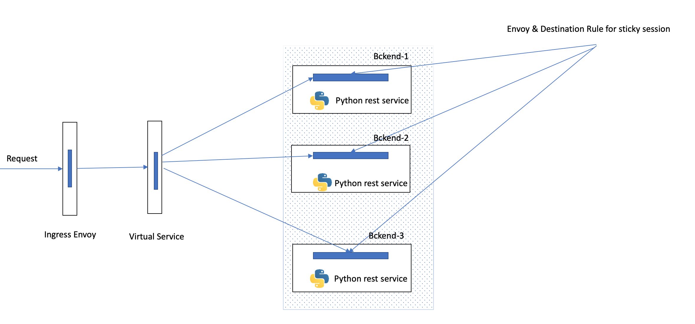
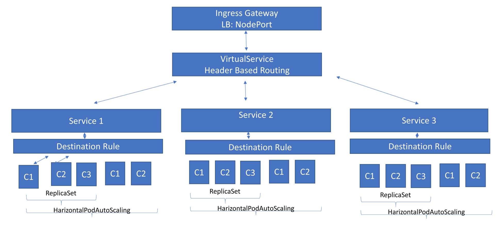

# Use Case : 

Define a service route for stateful service using header & sticky session based routing using ingress, virtualservice and destination rule.

1. Deploy three simple python backend services i.e app1.py, app2.py, app3.py. all have the same endpoint /hit_backend, which receives a message over HTTP REST endpoint (/hit_backend) and responds with the following output

		Request: {"target":"backend-1", "username":"user one"}
		Response: {"service_name":"backend-1","username":"user one","pod_id":"1"}
 
2. These 3 backend should be hosted on k8s setup within minikube/localhos.

		`app1.py -> backend-1`
		`app2.py -> backend-2`
		`app3.py -> backend-3`

each backend with a minimum of 3 and a maximum of 5 replicas for the above server process (auto-scaling).
 
3. A loadbalancer with k8s ingress or custom nginx/haproxy ingress controller that route /hit_backend traffic based on the following routing rules:

    Rule-1 : 
    
       Use "target" field in request body or request header to route to corresponding backend (i.e: "target":"backend-1" route to backend-1 service)
    Rule-2: 
    
        Sticky session - request with the same "username" should reach the same replicas if called within 1 minute from the previous one

## Key features :
	Header based routing using Istio VirtualService and Gateway
	Username based Sticky session using Istio DestinationRule
	The sticky session should expire in one minute
	Enabled Horizontal pod if resource utilization reaches 50%
	
## Steps

### 1. Steps to install istio in minikube
	1. Minikube should be installed and up n running
	    1.brew cask reinstall minikube
	    2.minikube start --memory=5120
	    3.minikube stop
	    4.minikube restart
	2. Download Istio https://doc.istio.cn/en/docs/setup/kubernetes/download-release/
	3. Follow steps https://istio.io/docs/setup/kubernetes/#downloading-the-release
	4. https://github.com/istio/istio/releases
	5. https://istio.io/docs/setup/kubernetes/install/kubernetes/ (Change gateway type as NodePort and install in demo.xml)
	6. https://istio.io/docs/tasks/traffic-management/ingress/ingress-control/#determining-the-ingress-ip-and-ports
	7. https://istio.io/docs/examples/bookinfo/
	8. Change istio-ingressgateway TYPE LoadBalancer to NodePort in install/kubernetes/istio-demo.yaml
	
	
### 2. Backend Server - Python (REST service)
	from flask import Flask, jsonify,request
	import socket
	import requests
	app = Flask(__name__)
	@app.route('/hit-backend', methods=['POST'])
	def backend1():
	content = request.get_json()
	content["target"] = "backend-1"
	content["podIp"] = socket.gethostbyname(socket.gethostname())
	return str(content);
	if __name__=='__main__':
	app.run(debug=True, host='0.0.0.0',port=8080)  
### 3. Docker file for Python 
	FROM alpine:3.9

	RUN apk add --no-cache python3 && \
	    python3 -m ensurepip && \
	    rm -r /usr/lib/python*/ensurepip && \
	    pip3 install --upgrade pip setuptools && \
	    if [ ! -e /usr/bin/pip ]; then ln -s pip3 /usr/bin/pip ; fi && \
	    if [[ ! -e /usr/bin/python ]]; then ln -sf /usr/bin/python3 /usr/bin/python; fi && \
	    rm -r /root/.cache
	WORKDIR /app
	COPY . /app
	RUN pip3 install virtualenv
	RUN virtualenv venv 
	RUN source venv/bin/activate
	RUN pip install flask flask-jsonpify flask-sqlalchemy flask-restful 
	RUN pip install requests
	EXPOSE 8080
	ENTRYPOINT [ "python" ]
	CMD [ "app-1.py" ]
	
### 4. K8s Resources
	1. K8s Services are  Backend-1, backend-2, backend-3
	2. ReplicaSet for corresponging services
	3. Horizantal Auto Scaling for ReplicaSet
	
### 5 K8s - Istio Resources
	1. DestinationRule to maintain sticky session
	2. Virtual Service for Header based routing
	3. Istio Gateway
### 6. Dockerfile
	 1.docker build -t kubia:1.0.0 .
	 2.docker tag kubia:1.0.0  kaleeswarankaruppusamy/e2esystem:kubia4
	 3.docker push  <DOCKER_REPO>:kubia4
### 7. K8S Deployment Files   (use --validate=false)
	  1. kubectl apply -f backend-1.yaml
	  2. kubectl apply -f backend-2.yaml
	  3. kubectl apply -f backend-3.yaml
	  4. kubectl apply -f backend-1-Destination-Rule.yaml
	  5. kubectl apply -f backend-2-Destination-Rule.yaml
	  6. kubectl apply -f backend-3-Destination-Rule.yaml
	  7. kubectl apply -f backend-gateway.yaml
	  8. kubectl apply -f backend-gateway-virtualservice.yaml
### 8.Sample Request and Reponse
	POST /hit_backend HTTP/1.1
	target:backend-2
        Content-Type:application/json
        x-user:kaleeswaran
	{
		"username": "user",
		"target":"backend-1"
	}

	Response : 
	{
	    "target": "backend-1",
	    "username": "user",
	    "podId": "backend-1-zlxtc"
	}
	
### Useful docker command
	Docker image prune --force
	docker image ls
	docker image rm
	docker load & Save
	docker ps -a 
	docker stop <containerid>
	docker rm 
### K8S Command
	1. brew cask install minikube   #install using virtualbox
	2. minikube status
	3. minikube delete
	4. minikube ip
	5. kubectl describe ing backend-ingress
	6. minikube dashboard   - K8s ui
	7. kubectl describe service servicename
	8. kubectl delete service servicename
	9. kubctl delete deployment deploymentname
	10 kubectl delete pod podname
	11. kubectl get service
	12. kubectl get pod
	13. kubectl get deplopyment
	14. kubectl get ReplicaSet
